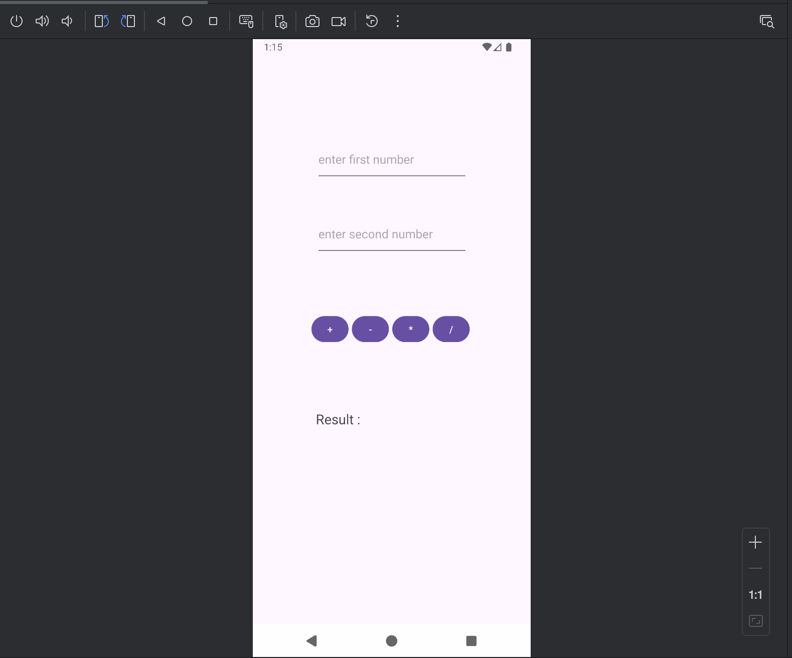

# 🧮 Basic Calculator - Kotlin Android App

A simple calculator application built using Kotlin for Android. It supports basic arithmetic operations such as addition, subtraction, multiplication, and division.

---

## 📱 Screenshot

Main UI of the calculator:

---

## 🚀 Features

- ➕ Addition  
- ➖ Subtraction  
- ✖️ Multiplication  
- ➗ Division  

---

## 🛠 Technologies Used

- Kotlin  
- Android SDK  
- Android View Binding  
- Material Design (Material3)  
